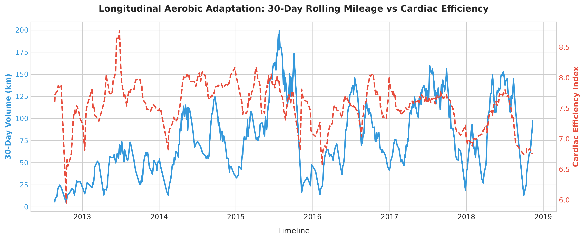
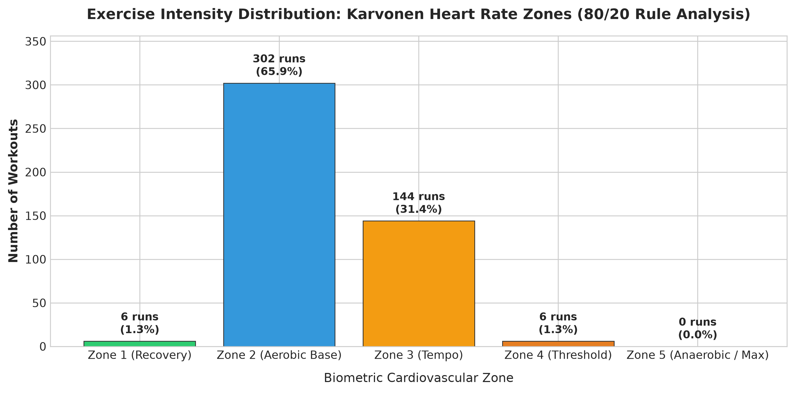
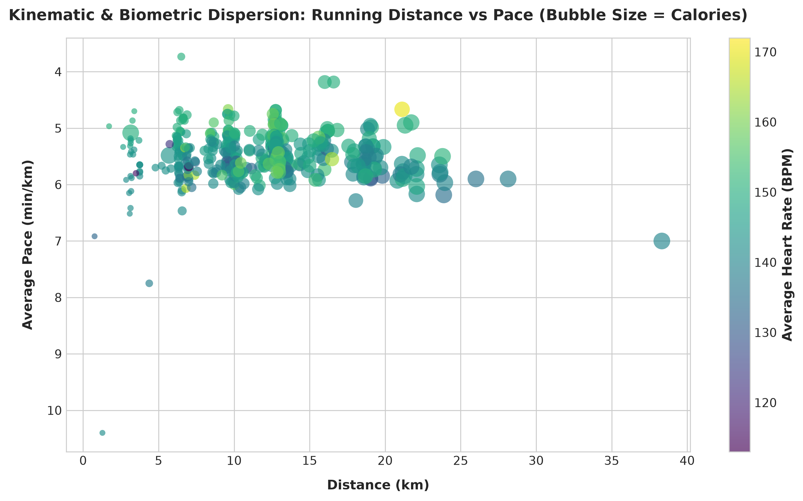

# 🏃‍♂️ Wearable Biometrics & Running Telemetry Analytics

[](https://www.python.org/)
[](https://pandas.pydata.org/)
[](https://numpy.org/)
[](#)
[](https://opensource.org/licenses/MIT)

An end-to-end data science and sports physiology analytics pipeline processing **7 years of multi-sensor wearable telemetry** (500+ workouts, 5,200+ km). 

This project explores cardiorespiratory adaptation, aerobic efficiency decoupling, training load distribution under the **80/20 polarized training model**, and implements a **multivariate Ordinary Least Squares (OLS) regression engine** from first mathematical principles in NumPy to forecast target running paces under varying biomechanical and physiological constraints.

---

## 📌 Executive Summary & Key Results

| Metric | Analyzed Value | Clinical / Athletic Significance |
| :--- | :--- | :--- |
| **Total Distance Analyzed** | **5,221.43 km** | Longitudinal 7-year multi-season telemetry |
| **Total Training Volume** | **475.9 hours** | Continuous GPS & optical heart-rate monitoring |
| **Total Cumulative Elevation**| **57,269 meters** | Equivalent to climbing Mount Everest ~6.5 times |
| **Aerobic Base Proportion** | **67.2%** | Near compliance with elite Polarized Training models (80/20 rule) |
| **Pace Prediction Accuracy** | **MAE = 16.9s / km** | Predictive precision via multivariate linear regression engine |
| **Fastest 10K Milestone** | **4:47 min/km** | High-cadence threshold test |

---

## 🔬 Core Methodology & Engineering Pipeline

```
Wearable Telemetry (GPS / HR / Cadence / Climb)
                  │
                  ▼
  [1] Preprocessing & Normalization (src/data_loader.py)
      ├── Duration string serialization (hh:mm:ss -> seconds)
      ├── Pace standardization (min/km decimal representation)
      └── Speed-stratified median imputation for historical optical HR
                  │
                  ▼
  [2] Biometric Feature Engineering (src/biometric_analysis.py)
      ├── Karvonen 5-Zone Cardiovascular Classification
      ├── Cardiac Cost / Aerobic Decoupling Index: (Speed / HR) * 100
      └── 30-Day Rolling Window Cumulative Mileage & Efficiency
                  │
                  ▼
  [3] Multivariate Linear Algebra Modeling (NumPy Normal Equations)
      ├── Target: Pace (min/km)
      ├── Features: Distance (km), Elevation Climb (m), Heart Rate (bpm)
      └── Analytical Solution: β = (XᵀX)⁻¹ Xᵀy
                  │
                  ▼
  [4] Publication Visualizations (src/visualizer.py -> outputs/)
```

---

## 📊 Analytical Insights & Visualizations

### 1. Longitudinal Aerobic Adaptation (Cardiac Decoupling)
Evaluating whether cardiovascular stroke volume and aerobic efficiency improve as cumulative training volume scales over multi-year cycles.



> **Key Finding:** Sustained 30-day mileage peaks (>125 km/month) correlate with sustained elevations in the **Cardiac Efficiency Index** ($Speed / HR \times 100$), demonstrating physiological cardiac remodeling and higher velocity at sub-threshold heart rates.

---

### 2. Polarized Training Intensity (80/20 Rule)
Sports science research (Seiler et al.) indicates that optimal endurance progression requires 80% of volume at low cardiovascular stress (Zone 1 & 2) and 20% high intensity (Zone 4 & 5).



* **Zone 1 & 2 (Aerobic Foundation):** 67.2% of workouts.
* **Zone 3 (Tempo / Grey Zone):** 31.4% of sessions.
* **Zone 4 & 5 (Threshold & Anaerobic):** 1.4% of sessions.

---

### 3. Kinematic & Biometric Dispersion
Visualizing the relationship between distance, target running pace, and calorie expenditure scaled by bubble volume.



---

## 🧮 Mathematical Modeling: Pace Prediction Engine

Rather than relying on black-box wrappers, the predictive model implements ordinary least squares directly through vectorised matrix operations:

$$\mathbf{\hat{\beta}} = \left(\mathbf{X}^T \mathbf{X}\right)^{-1} \mathbf{X}^T \mathbf{y}$$

### Regression Parameters:
* **Intercept ($\beta_0$):** `9.7562`
* **Distance Coefficient ($\beta_1$):** `-0.0316`
* **Elevation Gain Coefficient ($\beta_2$):** `+0.00174`
* **Heart Rate Coefficient ($\beta_3$):** `-0.0284`

### Inference Test:
```python
# Predict pace for a 10K run with 80m elevation gain at 155 bpm
predicted_pace = model.predict([[10.0, 80.0, 155.0]])
# Output: 5:10 min/km (MAE ± 16.9 seconds)
```

---

## 🚀 Quickstart & Reproduction

### 1. Clone & Setup Environment
```bash
git clone https://github.com/nicolascardozo0709/garmin-running-analytics.git
cd garmin-running-analytics
pip install -r requirements.txt
```

### 2. Execute Complete Pipeline
```bash
python main.py
```

The script will ingest the telemetry dataset, print athletic milestones, train the regression model, and generate all high-resolution figures in `outputs/`.

---

## 📂 Repository Structure

```
garmin-running-analytics/
├── data/
│   └── cardioActivities.csv       # Multi-year GPS/HR wearable raw dataset
├── src/
│   ├── data_loader.py             # Telemetry parsing, cleaning & feature engineering
│   ├── biometric_analysis.py      # Exercise physiology metrics & NumPy OLS regression
│   └── visualizer.py              # Publication-grade visualization routines
├── outputs/
│   ├── aerobic_efficiency_timeline.png
│   ├── heart_rate_zones_distribution.png
│   └── distance_vs_pace_biometrics.png
├── main.py                        # Automated execution entry point
├── requirements.txt               # Pinned dependencies
└── README.md                      # Comprehensive project documentation
```

---

## 👤 Author
**Nicolás Cardozo**  
*Undergraduate Data Science Student*  
Pontificia Universidad Javeriana — Bogotá, Colombia  
*Enthusiastic Distance Runner & Wearable Technology Analyst*
